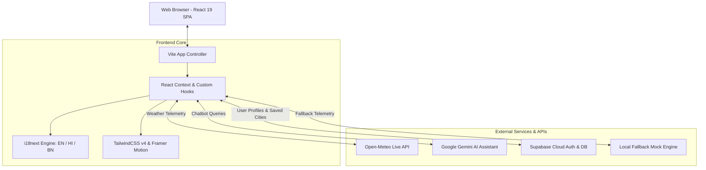

<div align="center">

# 🌦️ Mausam (मौसम / আবহাওয়া)
### *Next-Gen Hyper-Local Weather Intelligence & Geospatial Analytics Platform*

[](https://react.dev/)
[](https://www.typescriptlang.org/)
[](https://vitejs.dev/)
[](https://tailwindcss.com/)
[](https://supabase.com/)
[](https://ai.google.dev/)
[](https://open-meteo.com/)

<p align="center">
  <strong>Mausam</strong> is an intelligent, responsive, multi-lingual weather dashboard and geospatial climate platform designed for high-precision local forecasts, interactive radar mapping, air quality indexing, and conversational AI climate assistance.
</p>

[Explore Live Features](#-key-features) • [Architecture](#-system-architecture) • [Getting Started](#-installation--local-setup) • [Team &amp; Contributors](#-team--contributors)

</div>

---

## 🌟 Overview

**Mausam** bridges raw meteorological telemetry with human-centric interfaces. Designed from the ground up using **React 19**, **TypeScript**, and **TailwindCSS v4**, it provides actionable, real-time insights tailored to everyday life — whether planning a daily commute, scheduling outdoor athletics, preparing for heavy monsoon rains, or planning long-distance travel.

### Why Mausam?
- **Zero-Latency Response:** Dual-mode architecture utilizing real-time **Open-Meteo** API streams with high-performance mock fallbacks for resilient offline demonstrations.
- **Multilingual for Real Communities:** Native trilingual interface supporting **English**, **Hindi (हिंदी)**, and **Bengali (বাংলা)**.
- **AI-Powered Recommendations:** Context-aware weather chatbot powered by Google Gemini API providing advice on commute safety, fitness windows, and clothing recommendations.
- **Geospatial Mapping:** Interactive **Leaflet** map engine rendering cloud cover, precipitation heatmaps, and wind velocity vectors.

---

## 🚀 Key Features

### 1. 🌡️ Real-Time Hyper-Local Telemetry
- Dynamic current temperature with "Feels Like" thermal index.
- Comprehensive atmospheric metrics: Relative Humidity, Dew Point, Surface Pressure, Cloud Cover, Visibility, and Solar UV Index.
- High-precision wind vector tracking (wind speed, wind gusts, and directional cardinal compass).

### 2. 📈 Interactive Climate Visualizations (Recharts)
- **24-Hour Forecast Curve:** Interactive spline charts plotting hourly temperature fluctuations, rain probability, and UV index peaks.
- **7-Day Synoptic Outlook:** Weekly high/low temperature ranges with weather condition indicators and expected precipitation sums.

### 3. 🗺️ Geospatial Maps & Radar Layers (Leaflet)
- Integrated Leaflet & React-Leaflet GIS canvas with customizable tile providers.
- Real-time radar overlays for cloud density, rain precipitation, and interactive pin-drop search across global coordinates.

### 4. 🤖 Conversational AI Weather Assistant (Gemini)
- Smart AI assistant tuned for context-specific weather queries:
  - *Rain advisory:* Calculates evening precipitation probabilities and reminds users when to carry an umbrella.
  - *Fitness & Athletics:* Identifies optimal morning running and jogging windows based on UV and temperature curves.
  - *Travel & Packing:* Recommends appropriate apparel and packing checklists based on destination climate.

### 5. 🫁 Air Quality Index (AQI) & Health Metrics
- Multi-pollutant tracking: PM2.5, PM10, Ozone ($O_3$), Nitrogen Dioxide ($NO_2$), and Carbon Monoxide ($CO$).
- Categorical health severity badges (Good, Moderate, Unhealthy, Hazardous) with actionable health guidelines for sensitive groups.

### 6. 🌐 Multilingual Internationalization (i18n)
- Dynamic, real-time language switching without page reload.
- Full localization strings in **English**, **Hindi (हिंदी)**, and **Bengali (বাংলা)** via `react-i18next`.

### 7. 🔐 User Personalization & Cloud Persistence (Supabase)
- User authentication via Supabase Auth.
- Favorite cities bookmarking, custom home location pinning, and persistent theme preferences.

---

## 📐 System Architecture



---

## 🛠️ Tech Arsenal & Dependencies

| Category | Technology | Purpose |
| :--- | :--- | :--- |
| **Framework** | [React 19](https://react.dev/) | Component architecture, state management & concurrent features |
| **Language** | [TypeScript 5.7](https://www.typescriptlang.org/) | Strict typing, robust interfaces & autocomplete safety |
| **Build Tool** | [Vite 6.1](https://vitejs.dev/) | Lightning-fast HMR (Hot Module Replacement) and bundling |
| **Styling** | [TailwindCSS v4](https://tailwindcss.com/) | Next-generation dynamic CSS utility engine & modern theming |
| **Visualizations** | [Recharts 2.15](https://recharts.org/) | Responsive SVG charts for 24-hour and 7-day temperature curves |
| **Geospatial Maps**| [Leaflet](https://leafletjs.com/) & [React-Leaflet](https://react-leaflet.js.org/) | Interactive map canvas, radar overlays & location markers |
| **Animations** | [Framer Motion 12](https://www.framer.com/motion/) | Smooth UI micro-interactions, fade transitions & gestures |
| **Icons** | [Lucide React](https://lucide.dev/) | Clean, consistent SVG icon system |
| **Internationalization** | [i18next](https://www.i18next.com/) | Seamless English, Hindi, and Bengali localization |
| **Backend & Auth**| [Supabase JS](https://supabase.com/) | PostgreSQL backend, user auth, and saved location persistence |
| **Weather Source** | [Open-Meteo](https://open-meteo.com/) | Public weather forecast API (hourly, daily, elevation, solar data) |
| **AI Engine** | [Google Gemini API](https://ai.google.dev/) | Natural language weather assistant and lifestyle recommendations |

---

## 📁 Project Directory Structure

```
mausam_weather_app/
├── public/                     # Static assets and icons
├── src/
│   ├── components/             # Reusable UI component modules
│   │   ├── alerts/             # Severe weather and precipitation alerts
│   │   ├── auth/               # Supabase login and authentication modals
│   │   ├── chatbot/            # Gemini AI Weather Assistant interface
│   │   ├── demo/               # Showcase features and quick toggles
│   │   ├── health/             # Air Quality Index (AQI) and UV gauge cards
│   │   ├── layout/             # Navbar, Sidebar, Footer, and Theme switchers
│   │   ├── maps/               # Leaflet GIS canvas and radar layers
│   │   ├── modes/              # Commute, Fitness, Travel, and Agri mode selectors
│   │   ├── onboarding/         # First-time user welcome tour
│   │   ├── personalization/    # Saved locations and preferences
│   │   ├── search/             # City search autocomplete with geo-coordinates
│   │   └── weather/            # Hourly forecast, 7-day outlook, wind/pressure gauges
│   │
│   ├── config/                 # Environment variables and API config
│   ├── context/                # React Context providers (Auth, Weather, Settings)
│   ├── data/                   # High-fidelity mock weather data for offline fallback
│   ├── hooks/                  # Custom React hooks (useWeather, useGeolocation)
│   ├── i18n/                   # Language translation files (en.json, hi.json, bn.json)
│   ├── services/               # API service layers
│   │   ├── aiAssistant.ts      # Gemini AI prompt orchestration
│   │   ├── authService.ts      # Supabase authentication integration
│   │   ├── weatherService.ts   # Open-Meteo fetchers and data transformers
│   │   └── scoringService.ts   # Outdoor activity suitability scoring
│   │
│   ├── types/                  # TypeScript domain models and API schemas
│   ├── utils/                  # Unit conversions (C/F, km/h to mph), date helpers
│   ├── App.tsx                 # Root application component
│   ├── main.tsx                # Application entrypoint
│   └── index.css               # Global styling and TailwindCSS imports
│
├── .env.example                # Sample environment variables template
├── package.json                # Project dependencies and build scripts
├── tsconfig.json               # TypeScript compiler options
└── vite.config.ts              # Vite configuration
```

---

## ⚙️ Installation & Local Setup

### Prerequisites
- **Node.js** (v18.0.0 or higher recommended)
- **npm** or **yarn** / **pnpm**

### Step-by-Step Setup

1. **Clone the Repository:**
   ```bash
   git clone https://github.com/Tanmaybhar7/mausam_weather_app.git
   cd mausam_weather_app
   ```

2. **Install Dependencies:**
   ```bash
   npm install
   ```

3. **Configure Environment Variables:**
   Create a `.env` file in the root directory by copying the sample:
   ```bash
   cp .env.example .env
   ```
   Edit `.env` with your API keys (optional — the app includes built-in mock fallbacks if keys are omitted):
   ```env
   VITE_APP_TITLE=Mausam - Hyper-Local Weather Intelligence
   VITE_ENABLE_MOCK_FALLBACK=true
   VITE_OPEN_METEO_API_URL=https://api.open-meteo.com/v1
   VITE_OPENWEATHER_API_KEY=your_openweather_api_key_here
   VITE_GEMINI_API_KEY=your_gemini_api_key_here
   VITE_SUPABASE_URL=https://your-project.supabase.co
   VITE_SUPABASE_ANON_KEY=your_supabase_anon_key_here
   ```

4. **Start the Development Server:**
   ```bash
   npm run dev
   ```
   Open your browser and navigate to `http://localhost:5173`.

5. **Build for Production:**
   ```bash
   npm run build
   npm run preview
   ```

---

## 👥 Team & Contributors

This project was engineered and maintained with collaborative teamwork at **Brainware University**:

| Avatar | Team Member | Primary Role | Key Contributions | GitHub Profile |
| :---: | :--- | :--- | :--- | :---: |
| <a href="https://github.com/Tanmaybhar7"></a> | **Tanmay Bhar** | **Project Lead &amp; Full-Stack Architect** | Core system architecture, React 19 SPA, Open-Meteo &amp; Gemini AI integration, UI/UX design | [@Tanmaybhar7](https://github.com/Tanmaybhar7) |
| <a href="https://github.com/kundurohit544"></a> | **Rohit Kundu** | **AI / ML &amp; Intelligence Engineer** | Gemini AI weather assistant logic, contextual advisory prompts, and predictive scoring models | [@kundurohit544](https://github.com/kundurohit544) |
| <a href="https://github.com/Deb124-source"></a> | **Debdut Nandy** | **Data Modeling &amp; ML Analytics** | Meteorological data pipelines, historical climate telemetry, API response transforms &amp; QA | [@Deb124-source](https://github.com/Deb124-source) |
| <a href="https://github.com/SampradaDutta"></a> | **Samprada Dutta** | **Frontend &amp; UI/UX Developer** | Responsive layout engineering, user experience flows, component styling &amp; cross-device tuning | [@SampradaDutta](https://github.com/SampradaDutta) |
| <a href="https://github.com/ShubhamBTA5"></a> | **Shubham Saha** | **Full-Stack &amp; Cloud Engineer** | Supabase authentication, database persistence, backend services &amp; performance tuning | [@ShubhamBTA5](https://github.com/ShubhamBTA5) |
| <a href="https://github.com/Shuvojit-ds"></a> | **Shuvojit Shil** | **Frontend &amp; Visualizations** | Recharts 24-hr/7-day graphs, weather radar maps, interactive UI components &amp; testing | [@Shuvojit-ds](https://github.com/Shuvojit-ds) |

---

## 🔮 Future Roadmap

- [ ] Severe weather push alerts via Web Notifications API.
- [ ] Historical climate comparison charts (5-year seasonal trends).
- [ ] Extended satellite cloud radar animation loops.
- [ ] Offline PWA (Progressive Web App) service worker caching.

---

## 📄 License & Attribution

Distributed under the **MIT License**. Created with passion by **Tanmay Bhar**, **Rohit Kundu**, **Debdut Nandy**, **Samprada Dutta**, **Shubham Saha**, and **Shuvojit Shil** at **Brainware University**. Meteorological data courtesy of [Open-Meteo](https://open-meteo.com/).
