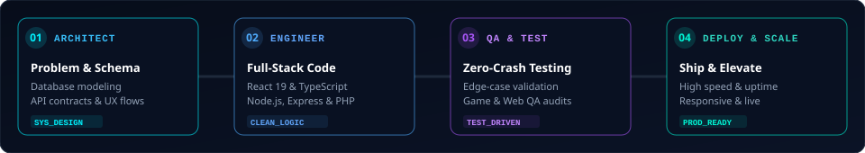
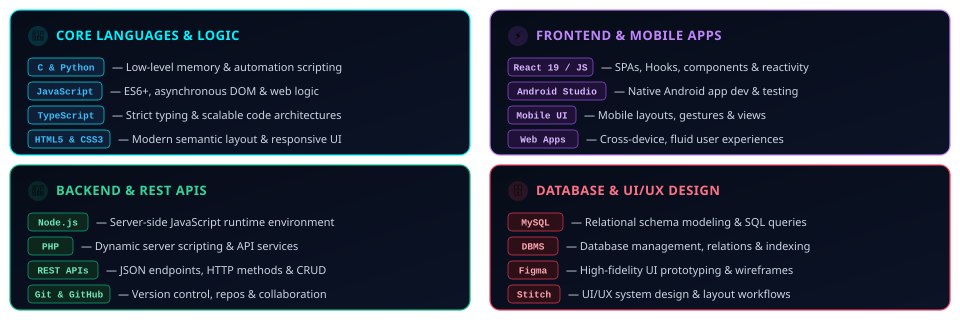
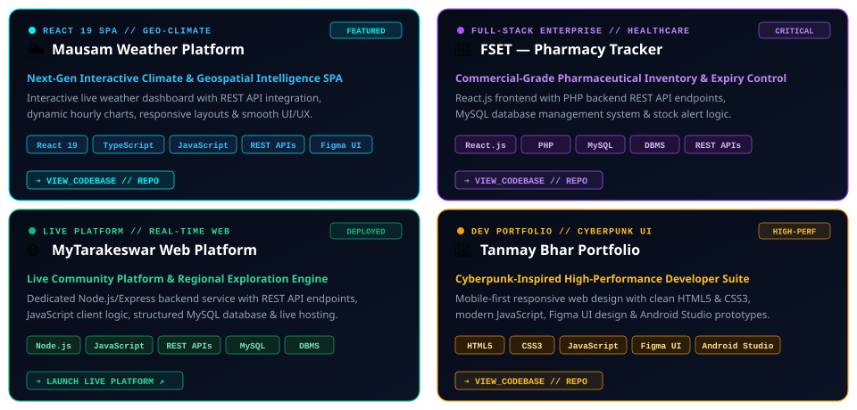
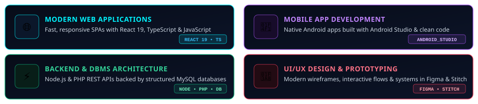

<div align="center">

<!-- HERO BANNER -->


<br/>

<!-- QUICK TELEMETRY BADGES -->
<p align="center">
  <a href="https://github.com/Tanmaybhar7">
    
  </a>
  <a href="https://linkedin.com/in/tanmaybhar7">
    
  </a>
  <a href="mailto:bhartanmay@gmail.com">
    
  </a>
</p>

</div>

---

### ⚡ `> WHOAMI`

```bash
tanmay@digital-builder:~$ whoami --verbose
```

> **Tanmay Bhar** is a Full-Stack Web Developer, Software Builder, and QA Enthusiast. Driven by a deep curiosity for building responsive, high-performance web ecosystems and resilient backend architectures. From crafting reactive single-page apps in **React 19 & TypeScript** to architecting robust REST APIs in **Node.js & PHP 8 PDO**, every build is designed to be fast, reliable, and aesthetically unforgettable.

```text
┌── [ CORE METRICS ] ────────────────────────────────────────────────────────┐
│  • Primary Focus    : Full-Stack Web Apps • REST APIs • Real-Time Systems  │
│  • Core Stack       : React 19 • TypeScript • Node.js • PHP 8 • MySQL     │
│  • Engineering Rule : Write clean logic, verify edge cases, ship quality.  │
│  • Current Velocity : Building modern web platforms & full-stack systems.  │
└────────────────────────────────────────────────────────────────────────────┘
```

<br/>

<div align="center">
  <!-- INTERACTIVE TERMINAL DIAGNOSTIC -->
  
</div>

---

### 🌐 `// DIGITAL BUILDER PIPELINE`

> A structured, engineering-first approach from whiteboard conception to bulletproof production deployment.

<div align="center">
  
</div>

---

### 🛠️ `// TECH ARSENAL & TOOLING`

<div align="center">

<!-- Skill Icons Matrix -->
<a href="https://skillicons.dev">
  
</a>

</div>

<br/>

<div align="center">
  <!-- ANIMATED TECH ARSENAL MATRIX -->
  
</div>

---

### 🚀 `// FEATURED PROJECTS & SYSTEMS`

Here is a curated selection of real-world full-stack applications and platforms:

<br/>

<div align="center">
  <!-- ANIMATED FEATURED PROJECTS SUITE -->
  

  <br/><br/>

  <!-- QUICK ACCESS REPOSITORY BUTTONS -->
  <p align="center">
    <a href="https://github.com/Tanmaybhar7/mausam_weather_app" target="_blank">
      
    </a>
    &nbsp;
    <a href="https://github.com/Tanmaybhar7/Pharmacy-Stock-and-Expiry-Tracker" target="_blank">
      
    </a>
    &nbsp;
    <a href="https://mytarakeswar.netlify.app" target="_blank">
      
    </a>
    &nbsp;
    <a href="https://github.com/Tanmaybhar7/portfolio" target="_blank">
      
    </a>
  </p>
</div>

---

### 📊 `// GITHUB TELEMETRY & ACTIVITY MATRIX`

<div align="center">

  <!-- MATCHING RATIO 1:1 DASHBOARD CARDS (340x200) -->
  <p align="center">
    
    
  </p>

  <!-- FULL WIDTH CYBER STREAK METRICS -->
  

</div>

---

### 🟢 `// THE GRID & CONTRIBUTION SNAKE`

> *"Every square on the grid represents another day I chose to build."*

<div align="center">

  <!-- CONTRIBUTION SNAKE ANIMATION -->
  <picture>
    <source media="(prefers-color-scheme: dark)" srcset="https://raw.githubusercontent.com/Tanmaybhar7/Tanmaybhar7/output/github-contribution-grid-snake-dark.svg" />
    <source media="(prefers-color-scheme: light)" srcset="https://raw.githubusercontent.com/Tanmaybhar7/Tanmaybhar7/output/github-contribution-grid-snake.svg" />
    
  </picture>

</div>

### 🎯 `// DOMAINS OF PASSION`

<div align="center">
  <!-- ANIMATED DOMAINS MATRIX -->
  
</div>

---

### 💬 `// THE HUMAN LOG`

<div align="center">
  <!-- ANIMATED DEVELOPER PHILOSOPHY CARD -->
  
</div>

---

### 🌐 `// INITIATE TRANSMISSION`

<div align="center">

  <!-- ANIMATED TRANSMISSION BANNER -->
  

  <br/><br/>

  <!-- CONNECT MATRIX BADGES -->
  <a href="https://linkedin.com/in/tanmaybhar7" target="_blank">
    
  </a>
  &nbsp;
  <a href="https://github.com/Tanmaybhar7" target="_blank">
    
  </a>
  &nbsp;
  <a href="https://mytarakeswar.netlify.app" target="_blank">
    
  </a>
  &nbsp;
  <a href="mailto:bhartanmay@gmail.com">
    
  </a>
  &nbsp;
  <a href="https://instagram.com/tanmay.cr7" target="_blank">
    
  </a>

</div>

<br/>

<!-- FOOTER BANNER -->
<div align="center">
  
</div>
